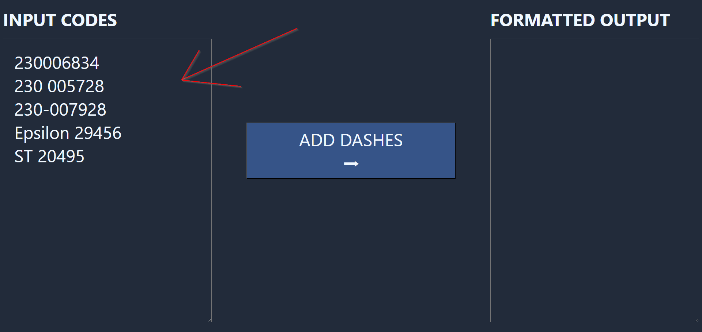
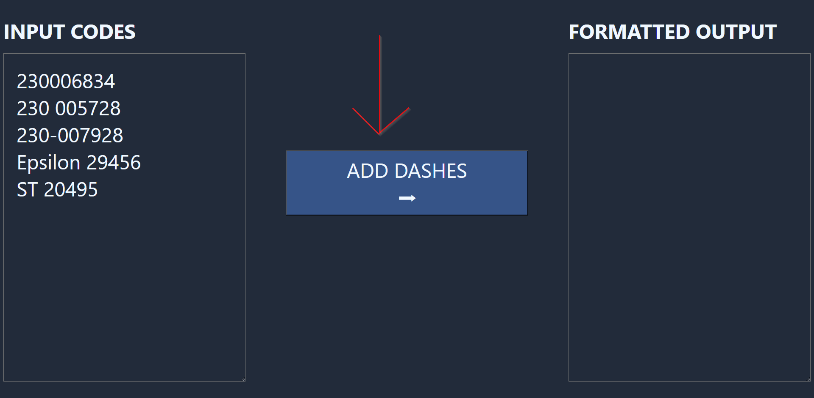
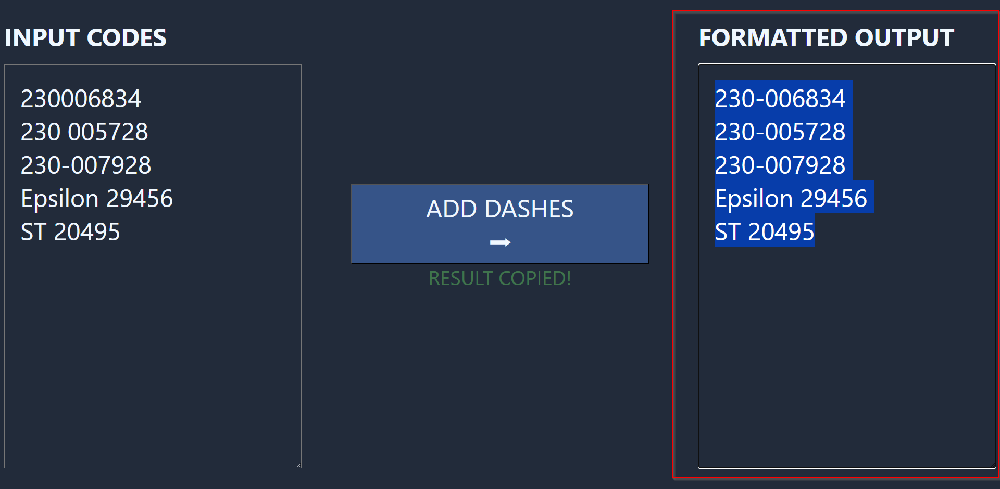
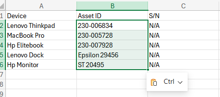

# Asset Code Dasher
Adds a dash to a list containing 230-style asset codes.

##Link to app website (no downloads needed): tva018.github.io/AssetCodeDasher

## How to use
1. Copy the column of asset codes. Do **NOT** select the header cell. 

- NOTE: You can copy the entire column of asset codes, the auto-dasher will NOT apply the dashes to any non-applicable asset codes
3. Paste the asset codes into the INPUT CODES text box 

4. Click Add Dashes 

5. The formatted output should be automatically copied to the clipboard, but you can manually copy from the Formatted Output text box if needed 

6. Paste the formatted codes back into the asset codes column 

